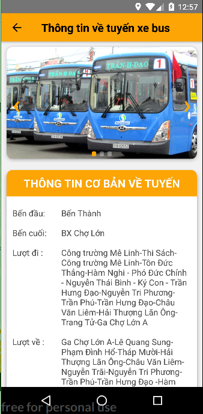

# react-native-project

Ứng dụng react native giành cho những người muốn tìm kiếm thông tin về xe bus và lịch trình của những xe đó, mỗi trạm có bao nhiêu xe bus đi qua

## Các chức năng của ứng dụng

1. Chức năng đăng nhập
2. Chức năng đăng ký
3. Chức năng xem các trạm xe bus, các tuyến xe bus qua các trạm đó và thông tin chi tiết của chúng
4. Xem danh sách các tuyến xe bus hiện đang hoạt động và chi tiết
5. Thêm thông tin trạm xe bus và thông tin các tuyến xe

## Nội dung

###Đăng ký

   

###Đăng nhập

    

###Xem các điểm, trạm dừng xe bus

* Tìm kiếm địa điểm, trạm dừng xe bus
* Xem thông tin trạm dừng (tên, miêu tả)
* Xem các tuyến xe bus đi qua trạm dừng đó
* Xem thông tin chi tiết tuyến xe bus đó

          

###Danh sách các tuyến xe bus đang hoạt động

* Xem danh sách các tuyến xe bus đang hoạt động trên địa bàn thành phố Hồ Chí Minh
* Xem chi tiết thông tin về các tuyến xe bus ấy

       

###Thêm thông tin

* Người dùng đóng góp thông tin các tuyến xe và các trạm xe bus cho cơ sở dữ liệu realtime của firebase

        

## Thư viện và công nghệ

- Language : Javascript

- FrameWork : React Native 0.57.7 - NodeJS 6.5.0

- Database: Firebase - https://console.firebase.google.com/u/0/project/busmap/database/busmap/data

* react-native - https://github.com/facebook/react-native

* react-navigation - https://github.com/react-navigation/react-navigation

* react-native-maps - https://github.com/react-native-community/react-native-maps

* react-native-google-places-autocomplete - https://github.com/FaridSafi/react-native-google-places-autocomplete

## Tác giả

Trần Hưng Quang - 15520693@gm.uit.edu.vn

Phạm Ngọc Quân - 15520680@gm.uit.edu.vn

Dương Văn Thanh - 15520801@gm.uit.edu.vn

